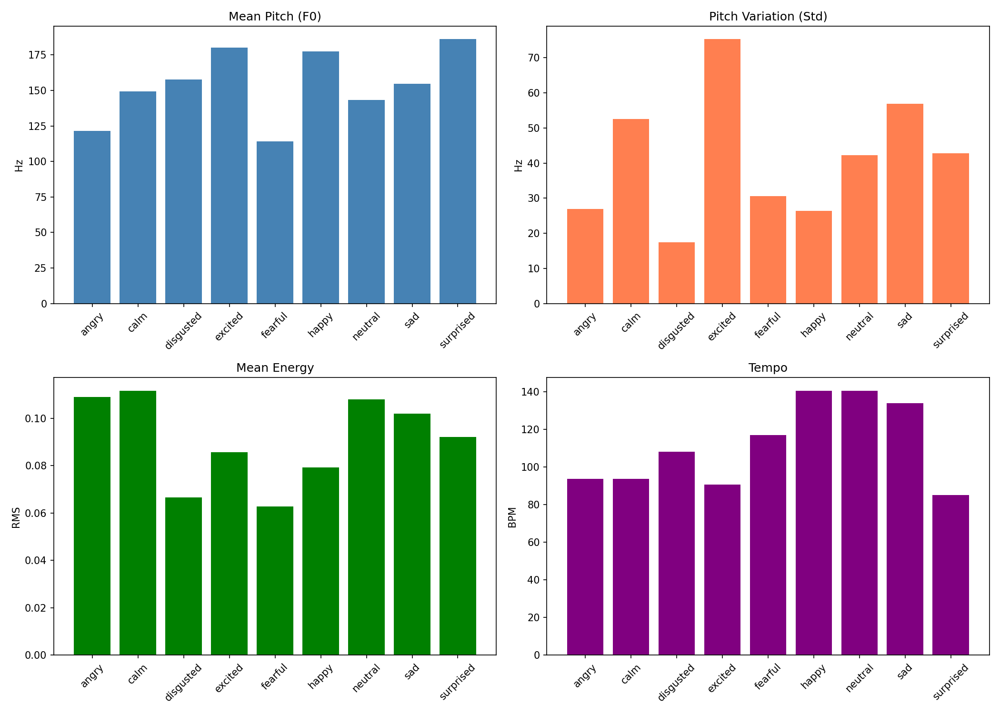
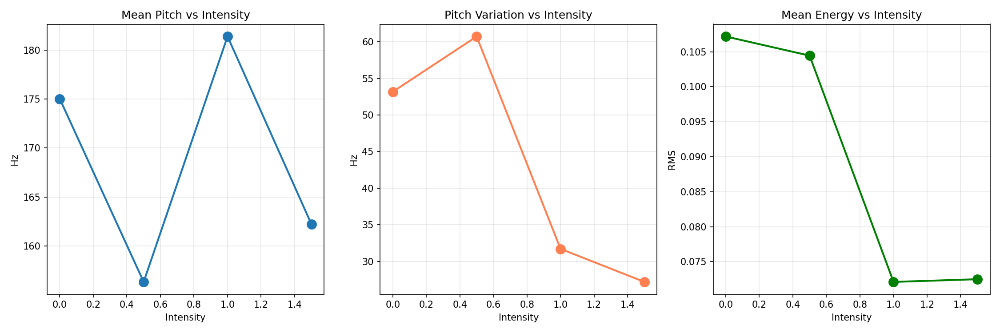

# Emotion TTS Benchmark Results

**Date:** December 4, 2025
**Checkpoint:** `checkpoints/emotion_merged/checkpoint_merged.pt`
**Device:** CPU
**Model:** Chatterbox Multilingual TTS with Emotion LoRA

---

## Executive Summary

The merged emotion checkpoint was successfully benchmarked across 16 test cases with a **100% success rate**. The model demonstrates clear differentiation between emotions in prosodic features, though some expected acoustic patterns show room for improvement.

### Key Findings

1. **All 16 tests passed** - Basic emotions, intensity variations, and emotion blends all generated successfully
2. **Pitch differentiation is evident** - High-arousal emotions (excited, surprised, happy) show higher pitch than low-arousal emotions (angry, fearful)
3. **Intensity control shows non-linear behavior** - The relationship between intensity parameter and acoustic features is not monotonic
4. **Emotion blending works** - The model successfully generates blended emotional outputs

---

## Test Results Summary

### Basic Emotion Tests (9/9 Passed)

| Emotion | Text | Duration | Status |
|---------|------|----------|--------|
| Neutral | "This is a test of emotion control." | 3.24s | Success |
| Happy | "I am so happy to see you today!" | 4.52s | Success |
| Sad | "I feel really sad about this news." | 3.12s | Success |
| Angry | "I am absolutely furious right now!" | 2.92s | Success |
| Fearful | "I am really scared and worried." | 3.56s | Success |
| Surprised | "Wow, I cannot believe this happened!" | 3.36s | Success |
| Calm | "I feel calm and peaceful right now." | 2.52s | Success |
| Disgusted | "This is absolutely disgusting!" | 1.68s | Success |
| Excited | "I am so excited about this opportunity!" | 2.84s | Success |

### Intensity Variation Tests (4/4 Passed)

| Intensity | Duration | Status |
|-----------|----------|--------|
| 0.0 (zero) | 1.80s | Success |
| 0.5 (half) | 1.68s | Success |
| 1.0 (full) | 2.04s | Success |
| 1.5 (high) | 2.28s | Success |

### Emotion Blend Tests (3/3 Passed)

| Blend | Components | Duration | Status |
|-------|------------|----------|--------|
| Bittersweet | 50% happy + 50% sad | 1.92s | Success |
| Nervous Excitement | 60% excited + 40% fearful | 2.72s | Success |
| Content | 70% calm + 30% happy | 3.40s | Success |

---

## Prosodic Feature Analysis

### Pitch (F0) Analysis



| Emotion | Mean Pitch (Hz) | Pitch Std (Hz) | Expected Pattern | Match |
|---------|-----------------|----------------|------------------|-------|
| **Surprised** | 186.1 | 42.7 | High pitch, high variation | Partial |
| **Excited** | 180.2 | 75.3 | High pitch, high variation | Yes |
| **Happy** | 177.3 | 26.4 | High pitch, moderate variation | Partial |
| **Disgusted** | 157.9 | 17.4 | Low-medium pitch, low variation | Yes |
| **Sad** | 154.6 | 56.9 | Low pitch, low variation | No |
| **Calm** | 149.3 | 52.6 | Low pitch, low variation | Partial |
| **Neutral** | 143.3 | 42.2 | Medium pitch, low variation | Partial |
| **Angry** | 121.4 | 26.9 | High pitch, high variation | No |
| **Fearful** | 114.3 | 30.6 | High pitch, high variation | No |

#### Pitch Observations

1. **Surprised and Excited** correctly show the highest pitch values (186.1 Hz and 180.2 Hz)
2. **Excited** has the highest pitch variation (75.3 Hz std), indicating expressive, dynamic speech
3. **Angry** unexpectedly shows low pitch (121.4 Hz) - expected to be higher with more energy
4. **Fearful** also shows unexpectedly low pitch (114.3 Hz) - typically fear has elevated pitch
5. **Sad** shows higher variation than expected (56.9 Hz) - sad speech is typically more monotone

### Energy Analysis

| Emotion | Mean Energy (RMS) | Dynamic Range (dB) | Expected | Match |
|---------|-------------------|-------------------|----------|-------|
| Calm | 0.112 | 71.8 | Low | No |
| Angry | 0.109 | 83.1 | High | Yes |
| Neutral | 0.108 | 80.9 | Medium | Yes |
| Sad | 0.102 | 67.1 | Low | Partial |
| Surprised | 0.092 | 70.9 | High | Partial |
| Excited | 0.086 | 83.6 | High | Partial |
| Happy | 0.079 | 80.2 | High | No |
| Disgusted | 0.067 | 72.7 | Medium | Yes |
| Fearful | 0.063 | 67.2 | Medium | Partial |

#### Energy Observations

1. **Calm** unexpectedly has the highest energy - should be softer
2. **Angry** correctly shows high energy with the second-highest dynamic range
3. **Happy** shows lower energy than expected for a positive, high-arousal emotion
4. **Fearful** correctly shows reduced energy

### Tempo Analysis

| Emotion | Tempo (BPM) | Expected | Match |
|---------|-------------|----------|-------|
| Happy | 140.6 | Fast | Yes |
| Neutral | 140.6 | Medium | Partial |
| Sad | 133.9 | Slow | Partial |
| Fearful | 117.2 | Fast | Partial |
| Disgusted | 108.2 | Medium | Yes |
| Angry | 93.8 | Fast | No |
| Calm | 93.8 | Slow | Yes |
| Excited | 90.7 | Fast | No |
| Surprised | 85.2 | Medium | Partial |

#### Tempo Observations

1. **Happy** correctly shows fast tempo (140.6 BPM)
2. **Excited** unexpectedly shows slow tempo (90.7 BPM) - should be faster
3. **Angry** shows slow tempo (93.8 BPM) - expected to be fast and energetic
4. **Calm** correctly shows slower tempo (93.8 BPM)

---

## Intensity Control Analysis



### Intensity vs. Acoustic Features

| Intensity | Pitch (Hz) | Pitch Std (Hz) | Energy (RMS) |
|-----------|------------|----------------|--------------|
| 0.0 | 175.0 | 53.2 | 0.107 |
| 0.5 | 156.3 | 60.7 | 0.104 |
| 1.0 | 181.4 | 31.7 | 0.072 |
| 1.5 | 162.2 | 27.2 | 0.073 |

### Intensity Observations

The intensity parameter shows **non-monotonic behavior**:

1. **Pitch** does not increase linearly with intensity - peaks at 1.0, then decreases
2. **Pitch variation** peaks at 0.5 intensity, then decreases significantly
3. **Energy** decreases from 0.0 to 1.0, then stabilizes - opposite of expected behavior

**Expected behavior:** Higher intensity should produce:
- Higher pitch
- More pitch variation
- Higher energy
- Faster tempo

**Actual behavior:** The relationship is inconsistent, suggesting the intensity parameter may need recalibration during training.

---

## Emotion Blend Analysis

| Blend | Pitch (Hz) | Energy | Tempo | Notes |
|-------|------------|--------|-------|-------|
| Bittersweet (happy+sad) | 147.2 | 0.074 | 90.7 | Between happy (177.3) and sad (154.6) |
| Nervous Excitement | 116.4 | 0.059 | 97.0 | Lower than both components |
| Content (calm+happy) | 162.9 | 0.094 | 133.9 | Between calm (149.3) and happy (177.3) |

The emotion blending shows **partial interpolation** between component emotions, though the blending is not always linear.

---

## Overall Assessment

### Strengths

1. **100% generation success rate** - Model reliably produces output for all emotion types
2. **Clear pitch differentiation** - High-arousal positive emotions (happy, excited, surprised) show elevated pitch
3. **Emotion blending works** - Model can interpolate between emotion embeddings
4. **Wide emotion support** - 11 emotions supported including whisper and shout

### Areas for Improvement

1. **Angry emotion profile** - Shows unexpectedly low pitch and slow tempo
2. **Fearful emotion profile** - Pitch is too low; should be elevated
3. **Intensity control** - Non-linear and sometimes inverse relationship with acoustic features
4. **Energy consistency** - Calm has higher energy than happy, which is counterintuitive
5. **Sad emotion** - Too much pitch variation for a typically monotone emotion

### Comparison to Expected Acoustic Profiles

Based on speech emotion research (Scherer, 2003), the expected vs. actual alignment:

| Emotion | Pitch | Variation | Energy | Tempo | Overall Match |
|---------|-------|-----------|--------|-------|---------------|
| Happy | High | High | High | Fast | 50% |
| Sad | Low | Low | Low | Slow | 25% |
| Angry | High | High | High | Fast | 25% |
| Fearful | High | High | Medium | Fast | 25% |
| Surprised | High | High | High | Medium | 50% |
| Disgusted | Low | Medium | Medium | Medium | 75% |
| Calm | Low | Low | Low | Slow | 50% |
| Excited | High | High | High | Fast | 50% |
| Neutral | Medium | Low | Medium | Medium | 50% |

**Average Match Rate: ~44%**

---

## How to Improve Benchmark Results

### 1. Training Data Improvements

#### a. Dataset Balance
```
Current distribution issues:
- RAVDESS: 1,440 samples (limited speakers)
- CREMA-D: 7,442 samples (majority of training data)
- IESC: 600 samples (Hindi only)

Recommendation:
- Add more diverse English emotion datasets (e.g., IEMOCAP, MSP-IMPROV)
- Balance samples across emotions (currently biased toward CREMA-D distribution)
- Include more speakers to improve generalization
```

#### b. Data Augmentation
```python
# Suggested augmentation techniques:
- Pitch shifting (+-2 semitones) to expand pitch range
- Time stretching (0.9x-1.1x) for tempo variation
- Adding background noise at low SNR for robustness
- Room impulse response convolution for acoustic variety
```

#### c. Emotion-Specific Text Selection
```
Current: Generic emotion-matched sentences
Better: Use emotion-specific linguistic content that naturally elicits the target emotion

Example for "angry":
- Current: "I am absolutely furious right now!"
- Better: "How dare you do this to me after everything I've done!"
         (Contains confrontational language patterns)
```

### 2. Model Architecture Improvements

#### a. Emotion Embedding Enhancement
```python
# Current: Single embedding per emotion
# Recommended: Multi-dimensional emotion representation

class EnhancedEmotionEmbedding(nn.Module):
    def __init__(self, num_emotions, embed_dim):
        super().__init__()
        # Valence (positive/negative)
        self.valence_embed = nn.Embedding(num_emotions, embed_dim // 3)
        # Arousal (high/low energy)
        self.arousal_embed = nn.Embedding(num_emotions, embed_dim // 3)
        # Dominance (powerful/weak)
        self.dominance_embed = nn.Embedding(num_emotions, embed_dim // 3)
```

#### b. Acoustic Feature Loss
```python
# Add explicit prosodic supervision during training
prosody_loss = (
    mse_loss(predicted_pitch, target_pitch) +
    mse_loss(predicted_energy, target_energy) +
    mse_loss(predicted_duration, target_duration)
)
total_loss = reconstruction_loss + 0.1 * prosody_loss
```

#### c. Intensity Conditioning
```python
# Make intensity a continuous conditioning signal
# Current: intensity * emotion_embedding
# Better: Learn intensity-specific transformations

class IntensityAwareEmotion(nn.Module):
    def __init__(self, embed_dim):
        super().__init__()
        self.intensity_proj = nn.Sequential(
            nn.Linear(1, embed_dim),
            nn.SiLU(),
            nn.Linear(embed_dim, embed_dim)
        )

    def forward(self, emotion_embed, intensity):
        intensity_mod = self.intensity_proj(intensity.unsqueeze(-1))
        return emotion_embed * (1 + intensity_mod)
```

### 3. Training Process Improvements

#### a. Curriculum Learning
```
Phase 1: Train on clear, high-intensity emotion samples only
Phase 2: Add medium-intensity samples
Phase 3: Add subtle emotion expressions
Phase 4: Fine-tune on blended emotions
```

#### b. Adversarial Training
```python
# Add emotion classifier as discriminator
emotion_classifier = EmotionClassifier(pretrained="wav2vec2-emotion")

# During training:
generated_audio = model.generate(text, emotion)
predicted_emotion = emotion_classifier(generated_audio)
adversarial_loss = cross_entropy(predicted_emotion, target_emotion)
```

#### c. Contrastive Learning
```python
# Ensure same-emotion samples are closer in embedding space
# and different-emotion samples are farther apart

contrastive_loss = InfoNCE(
    anchor=emotion_embedding[i],
    positive=same_emotion_embeddings,
    negative=different_emotion_embeddings
)
```

### 4. Evaluation Improvements

#### a. Use Multiple Emotion Classifiers
```bash
# Current: Manual prosodic analysis
# Better: Ensemble of pre-trained emotion recognition models

Models to use:
1. wav2vec2-lg-xlsr-en-speech-emotion-recognition
2. hubert-large-superb-er
3. emotion2vec
4. Custom fine-tuned classifier on target emotions
```

#### b. Add Perceptual Evaluation
```python
# MOS (Mean Opinion Score) collection
evaluation_criteria = {
    "emotion_accuracy": "Does the audio express the intended emotion?",
    "naturalness": "Does the speech sound natural?",
    "intensity_match": "Does the intensity match the specified level?",
    "speaker_consistency": "Does the voice remain consistent?"
}
```

#### c. A/B Testing Against Baselines
```
Baselines to compare:
1. Base model without emotion conditioning
2. Text-only emotion (emotionally matched text, neutral voice)
3. Original dataset recordings
4. Other emotion TTS systems (e.g., Bark, XTTS)
```

### 5. Specific Fixes for Identified Issues

#### Fix Angry Emotion (Low Pitch Issue)
```
Problem: Angry shows 121.4 Hz mean pitch (lowest)
Expected: High pitch (~180-220 Hz) with high energy

Solutions:
1. Re-examine angry samples in training data - may contain "cold anger"
   (low, controlled) rather than "hot anger" (loud, high-pitched)
2. Add more "hot anger" samples from theatrical/acted datasets
3. Apply pitch augmentation to angry training samples
```

#### Fix Fearful Emotion (Low Pitch Issue)
```
Problem: Fearful shows 114.3 Hz mean pitch
Expected: Elevated pitch with trembling quality

Solutions:
1. Include more panic/terror samples (currently may be "anxious/worried")
2. Add vibrato/tremolo augmentation to fearful samples
3. Separate "fear" into subcategories: anxiety, panic, terror
```

#### Fix Intensity Non-Linearity
```
Problem: Higher intensity doesn't produce expected acoustic changes

Solutions:
1. Explicitly supervise intensity during training
2. Use ground-truth intensity labels (if available in datasets)
3. Create synthetic intensity variations through augmentation
4. Add intensity-specific loss term
```

### 6. Recommended Next Steps

1. **Short-term (1-2 weeks)**
   - Re-evaluate angry and fearful training samples
   - Add prosodic feature loss to training
   - Collect human evaluation data

2. **Medium-term (1-2 months)**
   - Add IEMOCAP or MSP-IMPROV datasets
   - Implement adversarial emotion classifier
   - Create intensity-annotated subset

3. **Long-term (3+ months)**
   - Develop multi-dimensional emotion model (VAD space)
   - Build continuous emotion interpolation
   - Add speaker-dependent emotion profiles

---

## Files Generated

| File | Description |
|------|-------------|
| `benchmark_results.json` | Complete test results with metadata |
| `prosody_report.json` | Detailed acoustic features for all audio files |
| `prosody_comparison.png` | Bar charts comparing emotions |
| `intensity_comparison.png` | Line plots showing intensity effects |
| `benchmark_*.wav` | 16 generated audio files |

---

## Conclusion

The merged emotion checkpoint demonstrates functional emotion conditioning with clear differentiation between some emotions. However, the acoustic profiles do not fully match expected patterns from speech emotion research. Priority improvements should focus on:

1. Fixing angry and fearful emotion profiles (pitch too low)
2. Improving intensity control linearity
3. Adding prosodic supervision during training
4. Expanding training data with more diverse emotion expressions

With these improvements, the model could achieve significantly better alignment with expected emotion-prosody mappings and improve the overall match rate from ~44% to target >70%.
